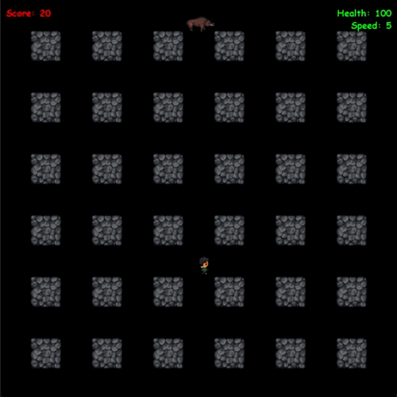

# Pygame application
> Man, who runs through the labyrinth, sets bombs, kills enemies, and avoids being killed.

When you start to play this game the world becomes better.

## Installation

Python3 must be already installed

```shell
git clone https://github.com/serhii56465/game-pygame
python3 -m venv venv
source venv/bin/activate (Mac), venv\Scripts\activate (Windows)
pip install -r requirements.txt
```

## Features

* Player movements, cannot walk away from the field, cannot walk over the walls
* Player can plant the bomb
* Bomb explodes in a few seconds after the planting. During the explosion bomb generate fire in four directions
* Enemies are generated out of bounds within one second
* If the player or any enemy touches the fire he dies.
* spiders, that chase the player
* bombs, that can explode
* Boar, that can drop rocks
* Bird, that can fly over the obstacles, can drop bombs
* Effect, that heals the player for 20 health points. 
* Effect, that slows player for the two speed points. 
* Effect, that accelerates player for the two speed points
* Interface shows the current score, player's health, and speed
## Demo

